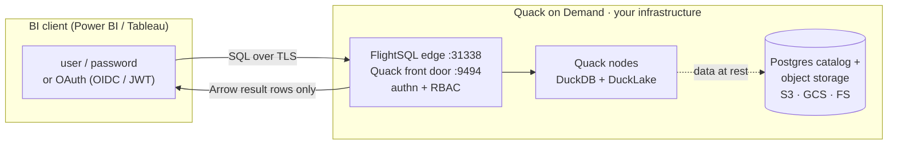

<p align="center">
  <picture>
    <source media="(prefers-color-scheme: dark)" srcset="assets/public/svg/lockupA-dark.svg">
    
  </picture>
</p>

# Quack on Demand

**The open-source serving layer for DuckDB and DuckLake.** Multi-tenant DuckDB serving with table, row, and column level security, and Arrow Flight SQL on the wire.

[](https://github.com/starlake-ai/quack-on-demand/actions/workflows/snapshot.yml)
[](https://github.com/starlake-ai/quack-on-demand/releases/latest)
[](https://hub.docker.com/r/starlakeai/quack-on-demand)
[](LICENSE)
[](https://discord.gg/xHj9D6Rebp)

```bash
uvx qod@latest serve --demo             # the full gateway on your laptop: no install, no Postgres
uvx qod@latest serve ./sales.duckdb     # the same gateway over YOUR DuckDB file, persistent + secured
uvx qod@latest serve ./warehouse/       # ...or a directory of parquet / csv
uvx qod@latest serve s3://bucket/data/  # ...or a remote prefix

# admin UI: http://localhost:20900/ui/
# FlightSQL edge: localhost:31338 
# DuckDB (native Quack): quack:localhost:9494
# Ctrl-C stops the gateway and its nodes; so does `uvx qod@latest stop` from another terminal
```

One command boots a seeded warehouse with row, column, and table security already live. Connect with `tenant=acme` + `pool=bi` (in the admin UI login, set the tenant to `acme`) and switch principals to watch the policies apply:

- `alice` / `demo-alice` (analyst) - `c_phone` comes back masked to `***`, and only `BUILDING`-segment rows appear
- `acme-admin` / `demo-acme-admin` - same query, full unmasked data
- a table `alice` has no grant on - denied

Client connection strings, printed again by the server at boot (replace `<tenant>`, `<pool>`, `<user>`):

```
JDBC : jdbc:arrow-flight-sql://localhost:31338/?tenant=<tenant>&pool=<pool>&user=<user>&useEncryption=true&disableCertificateVerification=true
ADBC : uri=grpc+tls://localhost:31338  (adbc_driver_flightsql; db_kwargs: username, password, plus grpc headers tenant=<tenant>, pool=<pool>)
ODBC : Driver={Arrow Flight SQL ODBC Driver};Host=localhost;Port=31338;UseEncryption=true;DisableCertificateVerification=true;UID=<user>;PWD=<password>;TENANT=<tenant>;POOL=<pool>
DuckDB : ATTACH 'quack:localhost:9494' AS qod (TYPE quack, TOKEN 'tenant=<tenant>&pool=<pool>&user=<user>&password=<password>');
```

### Hybrid: join your local DuckDB with QoD tables

Any DuckDB that carries the `quack` extension (the CLI, the Python package, an embedded DuckDB) can attach the gateway as a database over DuckDB's own native Quack protocol, no driver in between. The token string is the same set of parameters the JDBC URL takes after `?`. Local tables and gateway tables then join in one query; the gateway applies the user's row and column policies to its side, and a table the user has no grant on is refused with the same `access denied` a FlightSQL client would see.

```sql
ATTACH 'quack:localhost:9494' AS qod (TYPE quack, TOKEN 'tenant=acme&pool=bi&user=alice&password=demo-alice');
CREATE TABLE my_segments AS SELECT * FROM read_csv('segments.csv');
SELECT s.label, count(*) AS customers
FROM qod.tpch1.customer c JOIN my_segments s ON c.c_mktsegment = s.segment
GROUP BY 1 ORDER BY 2 DESC;

-- one-shot, no ATTACH
SELECT * FROM quack_query('quack:localhost:9494', 'SELECT count(*) FROM tpch1.orders',
  token := 'tenant=acme&pool=bi&user=alice&password=demo-alice');
```

The DuckDB client speaks plain HTTP to `localhost` and TLS to any other host; the gateway's Quack listener is plain HTTP by default (`QOD_QUACK_TLS_ENABLED=true` turns TLS on, reusing the FlightSQL edge's certificate), so from a remote machine either enable TLS or add `DISABLE_SSL true` to the `ATTACH` options. Superusers add `&superuser=true` to the token, exactly like the JDBC parameter.


## The missing serving layer

DuckLake gives you a Postgres-backed lakehouse catalog. DuckDB gives you the engine. Between them and a room full of analysts sits the part DuckLake [explicitly leaves out](https://ducklake.select/faq) by design: concurrent users, authentication, authorization, and connection routing.

Quack on Demand is that part. It turns a DuckLake lakehouse into a multi-tenant SQL warehouse your whole org can query: on-demand DuckDB nodes, least-loaded routing, table-level RBAC with column-level security and dynamic data masking, and Arrow Flight SQL on the wire so Power BI, Tableau, DBeaver, and any JDBC / ODBC / ADBC client just connect. Think self-hosted MotherDuck, scoped to serving, on your own infrastructure. Single binary.

## Who is this for?

**Use Quack on Demand if you want to:**

- Expose a DuckLake / DuckDB warehouse to multiple teams or apps over a standard wire protocol (Arrow Flight SQL: works with JDBC, ODBC, ADBC, PyArrow, DBeaver, Spark, and other Flight-aware clients)
- Authenticate users against your existing identity provider (Keycloak / Azure AD / Google / Cognito / JWT / database) and enforce table-level RBAC at query time
- Run several tenants on shared infrastructure without giving each one a private DuckDB process to manage; each tenant owns a separate DuckLake catalog DB

**Look elsewhere if you:**

- Just need a single embedded DuckDB inside one application: use DuckDB directly
- Need a distributed query engine with cross-node shuffles and joins on TB-scale tables: look at Trino / Dremio / StarRocks. Quack on Demand routes each statement to a single node; it doesn't fan out across them

---

## Quick start

### Native Linux / macOS / Windows

The command below boots a fully seeded instance against an **embedded, throwaway Postgres**. With [uv](https://docs.astral.sh/uv/) installed there are no other prerequisites - the launcher fetches everything it needs (sha256-verified against the GitHub release) and caches it under your user cache dir.

```bash
uvx qod@latest serve --demo   # the full gateway on your laptop: no install, no Postgres
```

`pip install qod && qod serve --demo` is equivalent. The `@latest` matters: uvx otherwise freezes on the first version it ever resolved.

### Docker

```bash
# trivial on Linux; on Mac/Windows requires Docker Desktop or a
# drop-in like Podman/Colima/OrbStack
docker run --rm -p 20900:20900 -p 31338:31338 starlakeai/quack-on-demand demo
```

It starts an embedded ephemeral Postgres, seeds tenant `acme` (`acme_tpch.tpch1`) with a small TPC-H dataset, boots the manager REST API on `:20900` and the FlightSQL edge on `:31338` (TLS on with an auto-generated self-signed cert; clients skip verification), and prints a connect snippet. All state lives under `/tmp/qod-demo` and is deleted when you stop it with Ctrl-C.

> Demo mode is insecure by design (self-signed TLS, open REST, demo credentials, ephemeral catalog). Use it to evaluate, never in production.

### Serve your own data

The demo is throwaway. To point the same gateway at data you already have, with
nothing else to install (no Postgres, no Docker):

```bash
uvx qod@latest serve ./sales.duckdb          # an existing DuckDB file
uvx qod@latest serve ./warehouse/            # a directory of parquet / csv
uvx qod@latest serve s3://bucket/sales/      # a remote prefix
uvx qod@latest serve                         # a fresh, empty DuckLake to load into
```

One command provisions a tenant, a database, and a pool around the target, then
prints the JDBC / ADBC / ODBC strings. The control plane runs on a bundled
embedded Postgres under your user data dir, and it persists: restart and
everything is still there. Re-running adds a second database beside the first,
so `qod serve ./other.duckdb` extends the same gateway rather than replacing it.

Unlike `--demo`, this keeps the normal secure posture: TLS on, database auth on,
ACL on, and a random admin password generated on the first run and printed once.
If a gateway is already running locally, `qod serve` provisions straight into it
instead of booting a second one; `qod stop` still stops it.

An existing `.duckdb` file is attached read-write and served by a single node.
Parquet and CSV targets become views (`read_parquet` / `read_csv`), so nothing is
copied or converted.

Not sure which command you want?

| Command | What it is | Needs |
|---|---|---|
| `qod serve --demo` | throwaway showcase on sample data, insecure by design | nothing |
| `qod serve ./your-data` | persistent gateway over your own data, secure defaults | nothing |
| `qod start` | your deployment: your own Postgres, your config | Postgres + `qod setup` |

For production, run against your own Postgres instead: see the deployment shapes
below.

### Full multi-tenant stack (Docker)

Zero to first query in under 5 minutes. Clone this repo, then:

```bash
cp .env.example .env                            # tweak ports / auth / admin password
LOAD_TPCH=1 ./scripts/run-docker-compose.sh     # pulls starlakeai/quack-on-demand:latest + seeds TPC-H SF=1
```
> **Windows: run inside WSL2** with `LOAD_TPCH=1 ./scripts/run-docker-compose.sh`

That brings up Postgres + the manager, bootstraps the demo tenants `acme` (tenant-db `acme_tpch` with pools `bi` and `etl`) and `globex` (pool `bi`), and seeds the DuckLake catalog with TPC-H at scale factor 1 (~6M lineitem rows) into `acme_tpch.tpch1`. The admin UI is on `http://localhost:20900/ui/` (log in `admin` / `admin` - change both before exposing anything beyond `localhost`). The FlightSQL edge is on `localhost:31338`; every client scopes its session with `tenant=acme` + `pool=bi`.

Connect a BI tool or client with the [connection strings at the top](#quack-on-demand) - for this stack use `tenant=acme`, `pool=bi`, user `admin`.

The Power BI walkthrough, full ADBC `db_kwargs` examples, and the Python load tester are in **[Quickstart](https://docs.starlake.ai/qod/getting-started/quickstart)** and **[Connecting clients](https://docs.starlake.ai/qod/connecting/clients)**.

Runnable client examples live in [`examples/`](examples/): FlightSQL clients in [TypeScript](examples/typescript/), [Python](examples/python/), [Java](examples/java/), and [Rust](examples/rust/), each running a single query and the 22 TPC-H queries. An [n8n community node](https://github.com/starlake-ai/qod-n8n-node) lives in its own repo.

### Production-level deployment

Past the demo, the manager runs against **your own Postgres** and your own object store.

Pick the deployment shape in the docs:

- **[Laptop deployment](https://docs.starlake.ai/qod/operating/deploy-local)** - nodes as child processes of the manager, against an external Postgres or the zero-prerequisite embedded control plane (`qod serve`, `QOD_PG_EMBEDDED=true`)
- **[Single-server production deployment](https://docs.starlake.ai/qod/operating/deploy-single-server)** - end-to-end walkthrough on one large server: sizing, existing Postgres + S3-compatible store, pool provisioning, RBAC, monitoring, with runnable scripts
- **[Docker Compose](https://docs.starlake.ai/qod/operating/deploy-docker)** - manager + Postgres as containers on a single host, persistent state bind-mounted
- **[Kubernetes](https://docs.starlake.ai/qod/operating/deploy-kubernetes)** - manager pod spawning node pods on demand; the Helm chart and a kind smoke-test rig live under [`charts/quack-on-demand/`](charts/quack-on-demand/)

Then harden it: **[Production hardening](https://docs.starlake.ai/qod/operating/hardening)**, **[TLS](https://docs.starlake.ai/qod/operating/tls)**, and the **[configuration reference](https://docs.starlake.ai/qod/reference/configuration)** (every `QOD_*` / `PROXY_*` env var).

---

## Features

Each table lists what Quack on Demand adds on top of a bare DuckDB process plus a DuckLake catalog.

### Connectivity

| Feature | Description | Added value over DuckDB / DuckLake alone |
|---|---|---|
| Arrow Flight SQL edge (`:31338`) | gRPC endpoint with TLS on by default (auto-generated self-signed cert; drop in a CA-signed one for prod) | DuckDB has no network listener. Any JDBC / ODBC / ADBC / PyArrow / Spark / DBeaver / Power BI / Tableau client connects without a DuckDB library on the client side |
| Native Quack front door (`:9494`) | A plain DuckDB client runs `ATTACH 'quack:host:9494'` and queries remotely, result bytes relayed untouched | Turns a local DuckDB into a thin client of the shared warehouse, with hybrid local-plus-remote joins, while the base tables never leave the server |
| `qod serve <target>` | One command over a `.duckdb` file, a parquet/csv directory, or an object-store prefix, control plane on a bundled embedded Postgres | Zero-install path from "files on disk" to a secured multi-user endpoint |
| `qod sql` and MCP query | Ad-hoc SQL from the CLI or from an AI agent, with optional `--branch` targeting | Scripted and agentic access share the same auth, ACL and audit path as BI users |

### Authentication and identity

| Feature | Description | Added value |
|---|---|---|
| Pluggable authenticators | Postgres / any JDBC backend (BCrypt passwords), external JWT (HS256 / RS256 / PEM), or OIDC (Keycloak with ROPC, Google, Azure AD, AWS Cognito) | DuckDB has no users. QoD ties every connection to an identity from your IdP |
| OIDC SSO for the admin console | Browser SSO, JWT session in an HttpOnly cookie | Admin access follows corporate identity |
| Personal access tokens | Self-scoped, tenant-inferred tokens with restrictions such as read-only, one database, or branch-only | Least-privilege credentials for agents and CI |
| SCIM 2.0 provisioning | Users and groups pushed by Okta / Entra | Joiner-mover-leaver lifecycle drives RBAC membership automatically |
| Account lockout and self-service reset | Opt-in lockout after N failed attempts (`QOD_AUTH_LOCKOUT_ENABLED`), single-use emailed reset link over SMTP. Database users can carry an email; an email-format username is its own email | Standard account hygiene the engine cannot provide |
| Forced password change | `mustChangePassword` blocks both the REST login and the FlightSQL handshake until the password is rotated | Onboarding and rotation policies enforced on the wire |
| Revocation kills statements | Revoking a grant or token cancels that principal's in-flight statements | Access removal is immediate, not "at next connect" |

### Authorization and data security

| Feature | Description | Added value |
|---|---|---|
| RBAC graph | Users, roles, groups, role permissions and pool permissions, computed into a cached **EffectiveSet** per session; two gates at handshake (user-scope, pool-access). See the [RBAC model](https://docs.starlake.ai/qod/operating/rbac-model) | Table-level grants for a database that has no `GRANT` statement |
| Per-statement ACL | SQL is parsed at the edge, table refs extracted, verb collapsed to Read / Write / Ddl and matched against grants | Enforcement is independent of client and node |
| Row-level security | Predicate filters injected per role by rewriting the statement (`QOD_RLS_ENABLED=false` as kill switch) | Same data, different rows per user, with no views to maintain |
| Column-level security and masking | Per-role policies on `catalog.schema.table.column` either **deny** the column or **mask** it through a custom SQL transform, applied before the node sees the statement (`QOD_CLS_ENABLED=false` as kill switch) | Dynamic masking without copying tables |
| Protected-write guard | Fail-closed deny on any write that wraps or references a masked or filtered table | Closes the classic "write it somewhere I can read" bypass |
| Attached-catalog resolution and ATTACH governance | Unqualified refs resolved fail-closed; `ATTACH` for ordinary users constrained to allowed catalogs | Prevents catalog-alias confusion from leaking cross-tenant data |
| Encryption at rest | `qod database create --encrypted` makes a DuckLake database write encrypted Parquet (DuckLake mints a key per file into its own catalog) or a `duckdb-file` database an AES-256-GCM encrypted file. Create-time only, per database, with `QOD_REQUIRE_ENCRYPTION` as the manager-wide policy gate. | DuckLake supports it but nothing forces it. QoD makes it a policy and keeps the key inside the control plane |
| Audit log | Every statement, admin mutation and autoscale action recorded with its actor, filterable in the console | DuckDB keeps no history of who ran what |

### Serving and routing

| Feature | Description | Added value |
|---|---|---|
| Node pools per tenant-db | Child DuckDB processes (local) or pods (Kubernetes) with roles `READONLY` / `WRITEONLY` / `DUAL` | DuckDB is single-process, single-writer. Pools give many concurrent users a compatible node each |
| Statement classification and least-loaded routing | Each statement is classified READ / WRITE / DDL and sent to a compatible, least-loaded node | Writes are funneled to write-capable nodes so DuckLake's single-writer constraint is enforced for the user, not by the user |
| Cache-aware routing | Reader affinity so repeated scans hit warm nodes | Better cache hit rates than random placement across N processes |
| Self-healing on restart | The registry is reconciled against the runtime backend; dead nodes are respawned before the edge accepts traffic. Full matrix in [Resilience](https://docs.starlake.ai/qod/operating/resilience) | Nothing in DuckDB restarts a crashed engine for you |
| Resume-on-query | A suspended pool wakes on the first statement with a bounded hold | Scale-to-zero without client-side retry logic |

### Multi-tenancy and isolation

| Feature | Description | Added value |
|---|---|---|
| Tenants, tenant-dbs, pools | Registry of tenants, each owning databases (`ducklake`, `duckdb-file`, `memory`) and pools; each DuckLake catalog DB (`${tenant}_${tenantDb}`) is auto-provisioned next to the control-plane DB | DuckLake has no notion of tenant. QoD isolates tenants at the Postgres-database boundary, not just row level |
| Tenant resource caps and quotas | Per-tenant limits on nodes and pools, enforced on every scale action including autoscale | Shared infrastructure without one tenant starving the others |
| Per-pool lockdown | Deny-set that blocks node-side escape hatches (file reads, other buckets, extensions) | A DuckDB process can read any path its OS user can. Lockdown closes that for served users |
| Filtered metadata | `information_schema` and `duckdb_*` catalog functions are filtered to what the principal may see | DuckDB shows every table to everyone. QoD hides what you cannot query |
| Regular-user profile sessions | Non-admin users log into the console for their own usage and statements only | Self-service without exposing the admin plane |

### Data lifecycle on DuckLake

| Feature | Description | Added value |
|---|---|---|
| Snapshot browser and time travel | Browse snapshots, query as-of a snapshot or timestamp from the UI or CLI | DuckLake stores snapshots. QoD makes them navigable without SQL archaeology |
| Table history timeline and data diff | Per-table change feed and diff between two snapshots | Turns raw `ducklake_snapshot_changes` into a reviewable change set |
| Tags and pinning | Named tags on snapshots; pinned snapshots survive maintenance | Human-readable release points that expiry cannot delete |
| Undrop | Recover a dropped table from an earlier snapshot | Operational safety net on top of DuckLake's retention |
| Restore and rollback | Roll a database back to a snapshot as a new snapshot | Point-in-time recovery as a one-liner |
| Managed maintenance | Scheduled expire-snapshots, merge-adjacent-files, cleanup-old-files and orphan sweep, leader-gated | DuckLake ships the functions; QoD schedules them, respects pins, and skips branches |
| Branches for agents and pipelines | `qod branch create` clones a DuckLake database at its current head without copying data (the branch reads the parent's Parquet in place and writes its own files), served by its own pool. Agents target it with the FlightSQL `branch` connection header or the MCP `branch` argument, review the change set (`qod branch changes` / `diff`, or the tenant page's Branches tab), propose a merge, and a *different* human fast-forward merges it into main in one stamped, tagged snapshot. A branch-only personal access token (`--branch-only`) makes writes on the live database impossible for that agent. Maintenance on main never expires a snapshot a live branch was forked from | Git-style workflow for agents and pipelines that DuckLake does not have |
| Database init SQL | Per-database or per-pool SQL run at node spawn | Consistent extensions, settings and secrets on every node |

### Storage and federation

| Feature | Description | Added value |
|---|---|---|
| Per-database object-store credentials | Each database carries its own endpoint and keys, injected as node secrets | Multiple buckets and clouds behind one gateway |
| Managed object storage | QoD provisions an id-keyed bucket prefix, with a retention window and purge sweep on delete | Self-service databases with no bucket plumbing by the user |
| Statement-level federation | Registered external sources (Postgres, MySQL, other catalogs) attached on the nodes, secrets resolved per source | Federated queries governed by the same ACL |
| External Iceberg REST catalogs | Attach Iceberg catalogs next to DuckLake, with SQL screening | One endpoint over lakehouse formats you did not create |
| Default metastore sparse create | Metastore keys omitted at create resolve from the manager defaults | Fewer secrets to hand around |

### Elasticity and high availability

| Feature | Description | Added value |
|---|---|---|
| Pool suspend / resume | Scale to zero keeping the role distribution; wake on REST, query, module, or idle policy | Pay for compute only while queried |
| Idle hibernation | Leader-gated sweep suspends pools after an idle window | Automatic cost control per pool |
| Demand scale-out | Owner-declared min / max band; readers added under load and shed when quiet | Elastic read capacity with a hard cap and quota gating |
| Active-active manager HA | N managers on Kubernetes, one leader by Postgres advisory lock, caches synced by LISTEN / NOTIFY | No single point of failure for the control plane |
| Kubernetes backend | Pod plus Service per node, Secrets for tokens, federation SQL and metastore passwords, pod resources and templates, registry-drift healing | Production deployment shape, with the local backend for a single box |

### Operability and administration

| Feature | Description | Added value |
|---|---|---|
| React admin console | `http://localhost:20900/ui/`: tenant / pool / user CRUD, per-user "Effective permissions" drilldown, live node dashboard (in-flight, total served, EWMA latency), incident-response page | Ops visibility DuckDB never had |
| Python CLI `qod` | Full REST parity with a pytest gate, profiles, install via `uvx` and PyPI | Scriptable operations, same contract as the API |
| Admin REST API | Every operation guarded by an `X-API-Key` static key OR a session token from `/api/auth/login`, tenant scope checked on every RBAC endpoint | Automation hook for IaC and portals |
| SQL admin dialect | Administer users, grants and pools over FlightSQL itself | DBA tools become admin tools |
| MCP server for AI agents | `POST /mcp`: agents authenticate with a personal access token (self-scoped, tenant-inferred) or the static key, and reach the full admin control plane (identity, access, pools and nodes, databases, maintenance and tags, time travel, federation, manifest, PATs, telemetry) gated by the same server-side guards as REST. See `skills/quack-on-demand/SKILL.md` ("Administering over MCP") | Agent-native administration and querying |
| Manifest YAML export / import | Whole-perimeter config as YAML with round-trip and fragments | GitOps for tenants, pools, grants and federation |
| Observability | Prometheus `/metrics`, or push to CloudWatch / Azure Monitor / GCP. Ships two Grafana dashboards: [single-node](observability/grafana-dashboard-single.json) and [Kubernetes](observability/grafana-dashboard-k8s.json). Statement history and trends in the console | Per-node latency, in-flight and served counters that an embedded engine does not expose |
| Usage accounting and metering | Per-tenant and per-user usage, statement history | Chargeback and hosted billing inputs |
| Incident response | Reader eviction, node restart, pool stop, blunt node reset | Operator levers for a live fleet |
| Manager module SPI | Jars on the classpath add tables, endpoints, SPA mounts, event sinks and leader-gated tasks | Hosted-service extensions without forking |
| Configuration | Every config key is overridable via a `QOD_*` env var | Twelve-factor deployment out of the box |
| Distribution | Single binary or Docker, native Linux / macOS / Windows including ARM, GitHub Releases, Claude Code plugin with the operator runbook | Install path measured in one command |

What QoD deliberately does not add: distributed joins across nodes. Each statement runs on exactly one DuckDB node, so TB-scale shuffle workloads still belong to Trino or Dremio.

---

## Architecture

### Data residency - the base tables never leave the server

When Power BI or Tableau connect with a **live / DirectQuery** connection, each user interaction issues SQL over the FlightSQL wire. The query runs on a Quack node, against DuckLake data that stays in your object storage, and only the *result rows* stream back as an Arrow batch. The base tables never cross the trust boundary onto the analyst's machine.



> **Live / DirectQuery only.** Power BI **Import** mode and Tableau **extract** mode copy the full dataset into a local `.pbix` / `.hyper` file by design - that data lands on the client regardless of the gateway. Use a live / DirectQuery connection when server-side residency is the goal.

---

## Configuration

Every scalar in `application.conf` accepts a matching `QOD_*` env-var override. The security-critical ones to set before any non-localhost deploy:

| Setting | Env var | Default |
|---|---|---|
| Static admin key | `QOD_API_KEY` | unset (open if unset!) |
| Session JWT secret | `QOD_SESSION_JWT_SECRET` | well-known dev string (change!) |
| Admin password | `QOD_ADMIN_PASSWORD` | `admin` (change!) |
| Metastore password | `QOD_PG_PASSWORD` | `azizam` (change!) |
| Enable per-statement RBAC | `QOD_ACL_ENABLED` | `false` |

Full reference: [Configuration](https://docs.starlake.ai/qod/reference/configuration).

Hosted / self-serve deployments should also harden the data plane:

- **`QOD_NODE_LOCKDOWN=true`** (default off, so first-run smoke tests keep working out of the box) denies `ATTACH`, extension `INSTALL`/`LOAD`, protected `SET`/`PRAGMA`s, and local-file read functions for non-superuser sessions, and freezes the DuckDB engine's settings for the process lifetime
- **Per-pool override** via `POST /api/pool/setLockdown` (tri-state `inherit`/`on`/`off`, superuser only), which restarts the pool's nodes immediately to apply the change
- **Network policy**: enable `networkPolicy.enabled=true` in the Helm chart to restrict node-pod ingress/egress
- **Catalog-reader eviction**: tune `QOD_CATALOG_READER_SWEEP_MIN` / `QOD_CATALOG_READER_IDLE_EVICT_MIN` if the default 10/30-minute cadence for evicting idle per-tenant-db catalog readers needs adjusting

The full hardening runbook is in `plugins/qod/skills/quack-on-demand/SKILL.md`.

## Claude Code skill

The operator runbook also ships as a Claude Code skill, so Claude can drive a live manager through the `qod` CLI. Install it one of two ways:

- With the CLI: `qod skill install` (after `uv tool install qod` or `pip install qod`) asks which LLM to install for (Claude Code, GitHub Copilot, Gemini CLI) and copies it into the matching skills directory (`~/.claude/skills` etc.; `--platform claude|copilot|gemini|all` skips the prompt); re-run after a CLI upgrade to refresh it
- As a plugin: `/plugin marketplace add starlake-ai/quack-on-demand`, then `/plugin install quack-on-demand@quack-on-demand`

## Documentation

Full guides, configuration reference, and REST API: https://docs.starlake.ai/qod
Jump to: [Quickstart](https://docs.starlake.ai/qod/getting-started/quickstart) · [Deployment](https://docs.starlake.ai/qod/operating/deploy-local) · [Configuration](https://docs.starlake.ai/qod/reference/configuration) · [Administration](https://docs.starlake.ai/qod/administration/onboarding) · [Architecture](https://docs.starlake.ai/qod/concepts/architecture) · [RBAC model](https://docs.starlake.ai/qod/operating/rbac-model) · [`CONTRIBUTING.md`](CONTRIBUTING.md)

## License

Apache 2.0.

## Community

- **Questions / discussion** -> [Discord](https://discord.gg/xHj9D6Rebp)
- **Bug or feature** -> file an issue using the templates

## Contributing

PRs welcome. See [CONTRIBUTING.md](CONTRIBUTING.md) for the dev loop and [CODE_OF_CONDUCT.md](CODE_OF_CONDUCT.md) for community standards. Start with an issue labelled `good first issue`.
